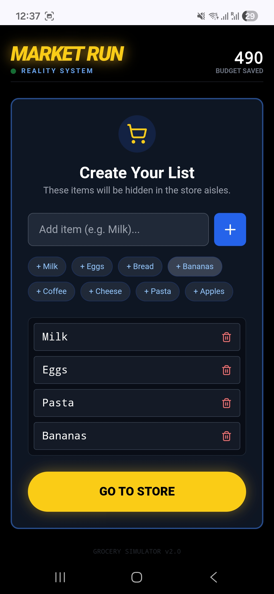

# Market Run: Reality Edition 🛒🏃‍♂️

**Built in 24 hours for HackCMU 2025**

> Turn your boring grocery run into an arcade adventure. Walk in the real world to move in the game.

## 💡 The Idea
We wanted to gamify the most mundane task: **Grocery Shopping**. 

Market Run is a Progressive Web App (PWA) that transforms your shopping list into a retro Pac-Man style level. As you physically walk through the aisles, the "Pac-Walker" moves through the digital maze. When you turn your body to check a shelf, the character turns with you.

Your goal? Find the items on your list (represented as Power Pellets) while avoiding the "Ghost Shoppers" (other customers).


## 🏪 Retail & Business Use Case
This isn't just a game; it's a new layer of engagement for retail stores.

*   **Interactive Loyalty:** Grocery stores can deploy this web app for their specific floor plan.
*   **Instant Rewards:** Instead of generic points, customers can unlock **Promo Codes** or **Discounts** (e.g., "5% off your total") by successfully collecting all items on their digital list.
*   **Product Discovery:** "Power Pellets" can be placed in specific aisles to guide customers toward promoted products or under-visited sections of the store.
*   **Health & Wellness:** Encourages walking and active movement while shopping.


## 🎮 How to Play
1.  **Build Your List:** Enter the items you need to buy (Milk, Eggs, Bread...).

2.  **Start the Run:** The app generates a maze populated with your items.
3.  **Walk:** Hold your phone and walk physically. The app uses the **Accelerometer** to detect steps.
4.  **Steer:** Rotate your body. The **Magnetometer/Compass** steers the character.
5.  **Win:** Collect all items to finish the run and (hypothetically) unlock your coupon!


## 🛠 Tech Stack
*   **Frontend:** React, TypeScript, Vite
*   **Styling:** Tailwind CSS (Retro/Neon aesthetic)
*   **Graphics:** HTML5 Canvas API
*   **Sensors:** `DeviceMotionEvent` (Pedometer) & `DeviceOrientationEvent` (Compass)

## 🚧 Challenges & Future Improvements
Since this was built in just **24 hours** for a hackathon, there is plenty of room to grow:

1.  **Sensor Tuning:** The step detection algorithm is currently a simple peak-detection model on the accelerometer. It can be sensitive to shaking or miss soft steps. Implementing a Kalman Filter would smooth this out.
2.  **Indoor Positioning:** Currently, movement is relative. The "Holy Grail" update would use Bluetooth Beacons or Wi-Fi RTT to map the user's *exact* location in the store aisle.
3.  **Dynamic Maps:** Integration with store APIs to generate the maze based on the actual floor plan of the specific grocery store you are in.

## 🚀 How to Run Locally

**Note:** This app requires **HTTPS** to access Accelerometer and Compass sensors on mobile devices.

1.  **Clone the repo:**
    ```bash
    git clone https://github.com/yourusername/market-run.git
    cd market-run
    ```

2.  **Install dependencies:**
    ```bash
    npm install
    ```

3.  **Run Development Server:**
    ```bash
    npm run dev
    ```

4.  **Test on Mobile:**
    *   You cannot simply open `localhost` on your phone.
    *   Use **ngrok** to tunnel your localhost to a secure URL:
        ```bash
        npx ngrok http 5173
        ```
    *   Open the `https` link provided by ngrok on your smartphone.

## 📜 License
Built for fun at HackCMU 2025.
